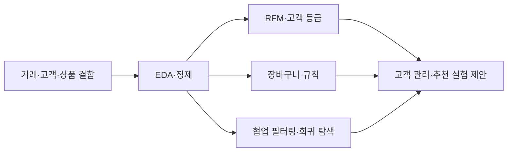

# 새벽배송 고객 구매 패턴과 추천 전략 분석

3년간의 거래·고객·상품 데이터를 연결해 **어떤 고객군을 관리하고, 어떤 상품을 함께 추천할지** 탐색했습니다. RFM 세분화·장바구니 연관분석·협업 필터링을 마케팅 실행 가설로 연결한 데이터 분석 프로젝트입니다.

> 포스코 청년 AI·Big Data 아카데미 32기 최우수상 — Big Data 부문, 5인 팀 프로젝트

## 프로젝트 한눈에 보기

| 항목 | 내용 |
|---|---|
| 의사결정 문제 | 고객가치와 구매 조합에 따라 관리·추천 전략을 어떻게 구분할 것인가? |
| 진행 기간 | 2026.03.02–2026.03.27 |
| 데이터 | 아카데미 제공 고객 3,000명 · 2023-01-02–2025-12-29 거래·상품 자료 |
| 분석 | EDA · PCA 가중 RFM · Apriori · User-User 협업 필터링 · 회귀 모델 탐색 |
| 도구 | Python · pandas · scikit-learn · mlxtend · XGBoost · LightGBM |
| 본인 역할 | EDA·전처리·결과 해석·시각화, 팀 기여도 40% |
| 산출물 | [팀 발표 보고서](docs/새벽배송_고객_구매_패턴_매출_증대_보고서.pdf) · [6개 분석 노트북](notebooks/) |
| 공개 범위 | 분석 코드·집계 설명·보고서. 원본·고객별 산출물 및 노트북 출력은 제외 |

## 핵심 발견과 활용 제안

| 관측 결과 | 해석 | 후속 실행 가설 |
|---|---|---|
| VIP `10.23%`, Gold `25.30%`, Silver `28.40%`, Bronze `36.07%` | PCA 가중 RFM으로 관리 등급 구성 | 유지·상향 전환 캠페인 분리 |
| VIP 고객당 3년 누적매출 약 `575만원`, Bronze 약 `341만원` | 누적 고객가치 차이. 주문당 객단가가 아님 | 혜택 비용과 매출 유지율 함께 측정 |
| R/F/M 가중치 `0.2882 / 0.3573 / 0.3544` | 분산 구조를 참고한 점수 설계 | 가중치·등급 경계의 민감도 확인 |
| 상위 장바구니 규칙 Lift `1.10–1.18` | 콩나물과 갈치·파스타 등의 구매 연관성 | 묶음 추천의 대조 실험 후보 |
| 고객 3,000명 × 소분류 58개에서 Top-5 추천 생성 | 추천 생성 경로 구현. 정확도·매출 개선은 미검증 | 시간 순서 검증 후 클릭·구매·기여이익 측정 |

위 수치는 당시 팀 분석·보고서의 기록입니다. 캠페인이나 추천 서비스를 운영해 매출 상승을 검증한 결과는 아닙니다. 세부 표와 방법은 [상세 분석 기록](docs/PROJECT_DETAILS.md)에 보존했습니다.

## 분석 흐름과 주요 판단



최근성·주문 빈도·누적 금액을 분리해 관리 대상을 정의했습니다. 연령대별 거래 규모는 고객 수와 인당 거래량을 함께 보고, 연관 규칙·추천 점수와 실제 효과를 구분했습니다. 회귀 모델은 탐색 단계이며 시점 분할 검증 전에는 미래 수요 예측 성과로 제시하지 않습니다.

## 주요 문서와 파일 구조

| 노트북 | 내용 |
|---|---|
| `01_user_eda.ipynb` | 고객·주문 패턴 탐색 |
| `02_member_eda.ipynb` | 멤버십별 구매 패턴 |
| `03_item_eda.ipynb` | 상품 정제·카테고리 탐색 |
| `04_rfm_analysis.ipynb` | PCA 가중 RFM·등급 분포 |
| `05_association_analysis.ipynb` | 장바구니·연령대별 연관 규칙 |
| `06_collaborative_filtering.ipynb` | 추천 생성·회귀 모델 탐색 |

노트북은 `notebooks/`, 데이터 구조는 `data/README.md`, 팀 보고서와 상세 분석은 `docs/`에 정리했습니다. [데이터 안내](data/README.md) · [상세 기록](docs/PROJECT_DETAILS.md) · [팀 발표 보고서](docs/새벽배송_고객_구매_패턴_매출_증대_보고서.pdf).

## 실행 조건과 확인 방법

원본은 이용 권한이 있는 경우에만 별도로 준비합니다. `01`, `02`, `04`–`06`은 **기존 병합 전처리본 `data/processed/df_merged.csv`를 입력으로 사용**합니다. 원본 CSV 3개만 배치하고 `01`부터 실행하면 전체 결과가 자동 재현되는 구성은 아닙니다.

```bash
python -m venv .venv
# macOS/Linux: source .venv/bin/activate
# Windows PowerShell: .\.venv\Scripts\Activate.ps1
pip install -r requirements.txt

# 사용 권한이 있는 입력과 병합 전처리본을 준비한 뒤
cd notebooks
jupyter notebook
```

`notebooks/`를 작업 경로로 사용합니다. 고객별 거래·추천 미리보기 노출을 줄이기 위해 기존 출력과 실행 번호를 비웠습니다. 집계 결과는 README와 팀 보고서로 확인합니다. 데이터가 없어 이번 검토에서는 모델 학습·수치 재계산을 수행하지 않았습니다.

## 한계와 후속 검증

- 제공 표본을 다른 서비스의 고객으로 일반화하지 않습니다.
- PCA 설명 분산은 고객가치나 추천의 예측 성능이 아닙니다. 점수 설계의 민감도 분석이 필요합니다.
- Lift·유사도는 인과효과·정확도·매출 개선을 뜻하지 않습니다.
- 신규 고객의 cold start, 브랜드 차이, 시간에 따른 추천 품질을 추가 검토해야 합니다.
- 회귀 비교에는 시점 검증·기준선 비교가 필요합니다. 추천 효과는 대조 실험으로 증분 구매와 기여이익을 확인해야 합니다.

## 프로젝트 정보

아카데미 32기 C반의 5인 팀 프로젝트입니다. 본인은 EDA·전처리·해석·시각화를 담당했습니다. 코드는 [MIT License](LICENSE)를 따르며 제공 데이터의 이용 조건은 별도입니다.

최진원 · [GitHub](https://github.com/jinwon25)
